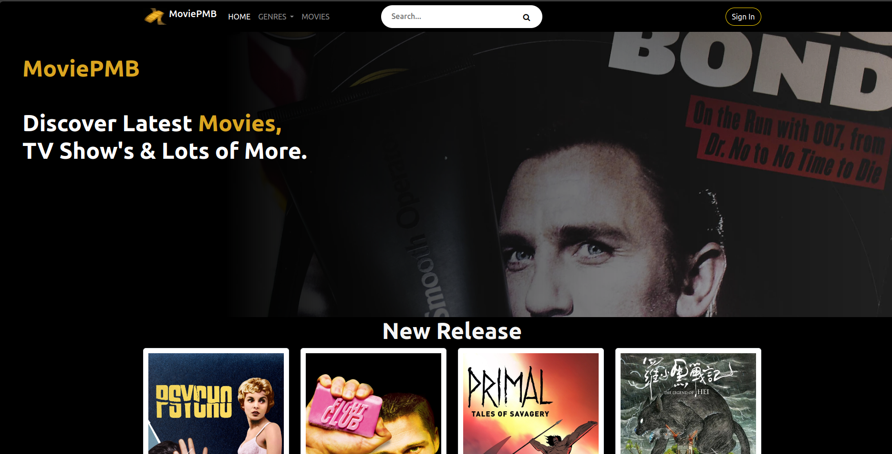

# MoviePMB



## Features

- Django-based user friendly project for accessing data.
- Our MoviePMB Django project retrieves and updates movie data from [The Movie Database (TMDb) API](https://developer.themoviedb.org/reference/intro/getting-started). This third-party integration allows us to keep our database up-to-date with the latest movie information.
- Multi-role authentication:
  - Admins: Full access to CRUD operations.
  - Registered Users: Access to read IMDb data.
  - Authenticated Users: 
    - Can create thier own favorite movie list and later get personal recommendation.
    - Can rate movies (html in progress).
    - Can comment movies (html in progress).
  - Anonymous Users: Limited access.
- Search functionality for finding movies by title.
- Testing.
- Security:
    - Authentication and authorization checks (registration by Google account in progress, also "Forgot Password?" in progress).
    - Protection against common web vulnerabilities.
- Swagger documentation for API endpoints.
- PostgreSQL database for efficient data storage(We used [Render](https://render.com/)).
- Cloud deployment for scalability and accessibility(We used [Amazon Web Services (AWS)](https://aws.amazon.com/)).
- Bootstrap 5 for responsive design.
- Newsletter (in progress)
- Filtering by Genre

### Movie Recommendation Algorithm

Our project includes a powerful recommendation algorithm that suggests movies to users based on their preferences, movie descriptions and genres. This algorithm analyzes the descriptions of movies you've interacted with and identifies similar movies that you might enjoy.

#### How It Works

1. **User Interaction Tracking**: The algorithm keeps track of the movies you've rated, liked, or interacted with in any way.

2. **Description Analysis**: It analyzes the descriptions and genres of these movies, extracting key features and keywords.

3. **Similarity Calculation**: Using advanced natural language processing (NLP) techniques, the algorithm calculates the similarity between movie descriptions.

4. **Recommendation Generation**: Based on the calculated similarities, the algorithm generates a list of movie recommendations that match your preferences and interests.

5. **Personalized Experience**: The more you interact with movies on our platform, the more personalized and accurate your recommendations become.

#### Enhancing Your Movie Discovery

Our recommendation algorithm is designed to enhance your movie discovery experience. It helps you discover hidden gems and movies that align with your taste, making your time on our platform more enjoyable and tailored to your interests.


## Installation

1. Clone the repository to your local machine:

   ```shell
   git clone https://github.com/MarcinIgna/imdb-django-api.git
   ```

2. Create a virtual environment (recommended) to isolate project dependencies:

   ```shell
   python -m venv venv
   ```

3. Activate the virtual environment:

   - On macOS and Linux:

     ```shell
     source venv/bin/activate
     ```

   - On Windows (PowerShell):

     ```shell
     .\venv\Scripts\Activate
     ```

4. Install project dependencies from the `requirements.txt` file:

   ```shell
   pip install -r requirements.txt
   ```

## Database Setup

1. Create the database schema by running migrations:

   ```shell
   python manage.py makemigrations
   ```

   ```shell
   python manage.py migrate
   ```

## Running Custom Scripts
- To edit numbers for populating check files add_movies.py/add_person.py in management/commands folder.
- To run custom management scripts for populating your database with data, use the following command:

```shell
python manage.py run_custom_scripts
```


## Usage

1. Start the Django development server:

   ```shell
   python manage.py runserver
   ```

2. Open your web browser and navigate to [http://localhost:8000](http://localhost:8000) to access your Django project.

## Contributing

If you'd like to contribute to this project, please follow these steps:

1. Fork this repository.
2. Create a new branch for your feature or bug fix.
3. Make your changes and commit them.
4. Push your changes to your fork.
5. Submit a pull request to the original repository.

## License
Free to use
